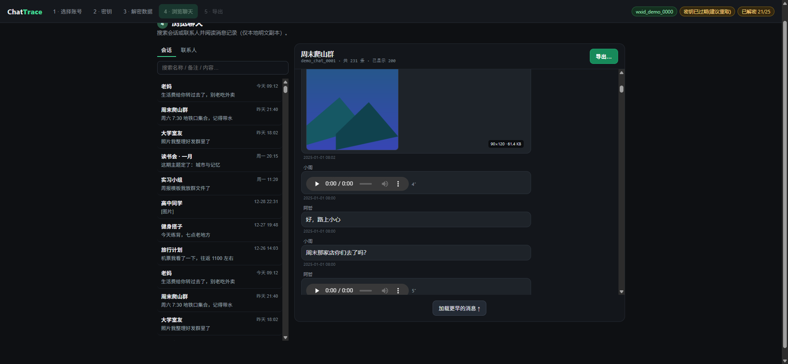
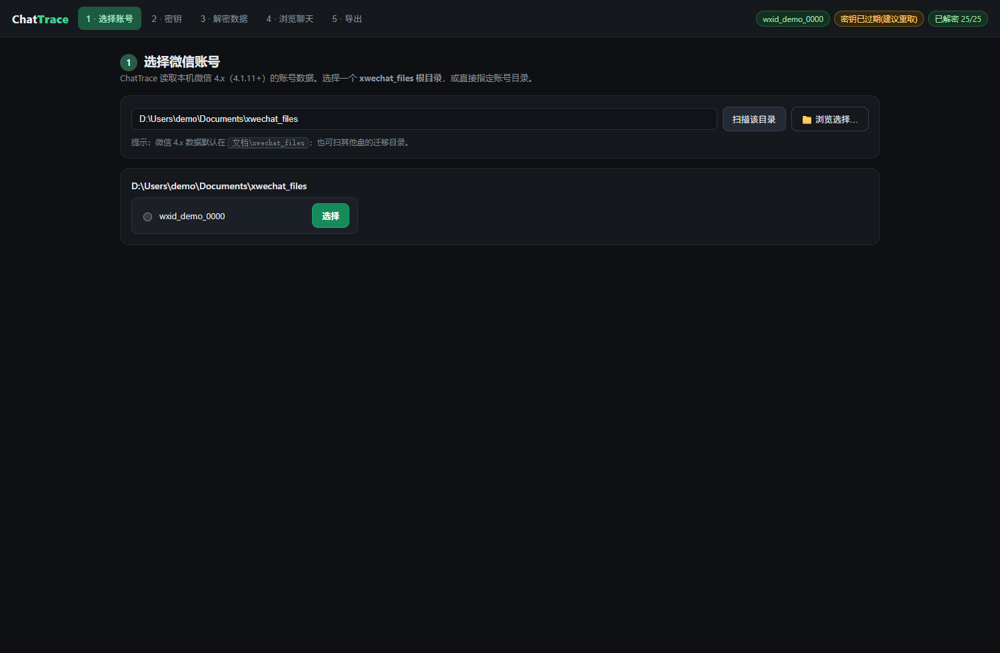
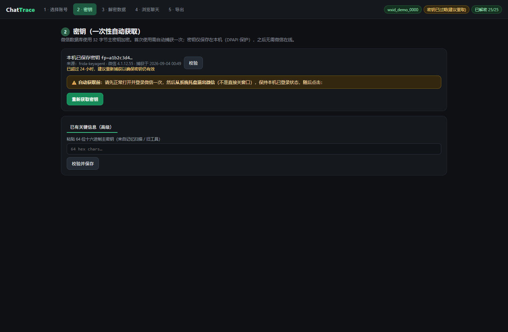
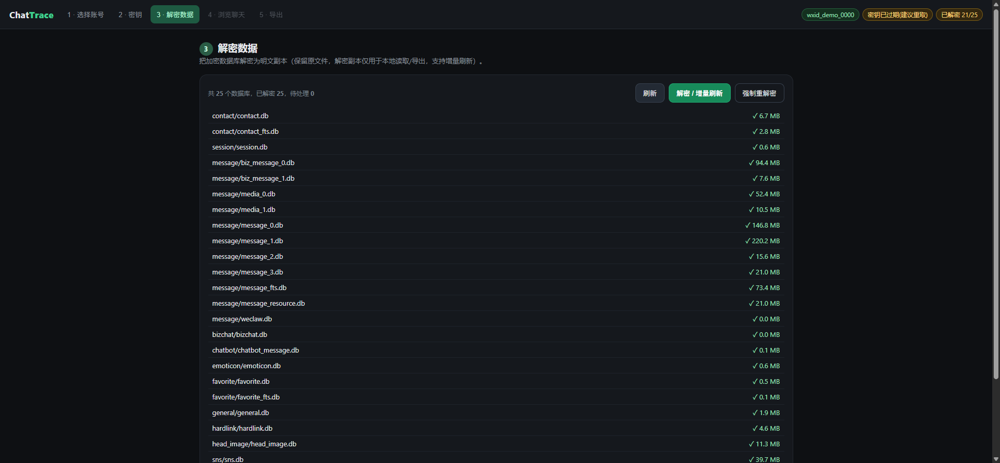
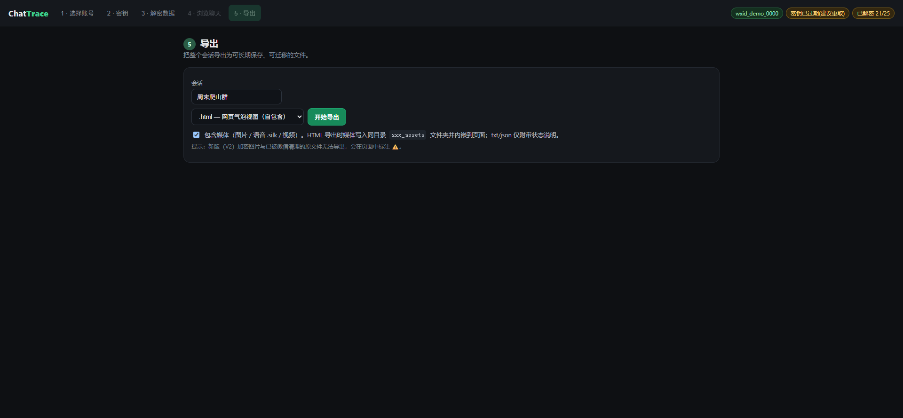

# ChatTrace

[](LICENSE)
[](https://github.com/qiaodogbear/ChatTrace/releases)
[](https://python.org)
[](#快速开始)
[](https://frida.re)

**完全本地的微信 4.x（4.1.11+）聊天数据工具链**：自动获取密钥 → 全库解密 → 引导式浏览 → 文本与媒体导出。
解压即用，无云端、无上传、无遥测。

> **ChatTrace** is a fully local toolchain for WeChat 4.x (4.1.11+) chat data on Windows:
> capture the database key with Frida, decrypt, browse, and export — text **and** media —
> without a single byte leaving your machine.



<sub>引导式 Web UI：消息气泡视图 · **图片直接显示（含加密的 V2 容器）** · **语音在页面内直接播放** ·
文件 / 链接 / 引用 / 位置 / 通话渲染为卡片 · 少数无法解码的内容显示为带尺寸与原因的说明卡片
（截图为演示数据，真实昵称 / 路径 / 内容已替换）</sub>

---

## 项目缘起

聊天记录是一个人最完整的自传：谁在你低谷时说过什么、父母十年里每天的碎碎念、
已经散场的群聊里那些没头没尾的笑话。它比相册更密、比日记更真。

但这份"自传"在技术上处于一个尴尬的位置：

- **它被加密锁在你自己的硬盘上。** 微信 4.x 的数据以 SQLCipher 4 加密存于本机
  （`xwechat_files\<账号>\db_storage\`），密钥只在登录时存在于内存中。
- **官方不提供完整导出。** 微信自带"聊天记录迁移"服务于换手机这一场景，
  既不能按会话归档，也不面向长期保存；一旦设备损坏、卸载重装、账号异常，
  记录就随设备一起消失。
- **社区工具在 4.1.11 之后集体失效。** 此前广泛使用的方案依赖在进程内存中
  扫描密钥的十六进制字面量；微信 4.1.11+ 移除了这种内存形态，导致这一类
  工具（包括若干知名开源项目）在 4.1.11+ 上**再也拿不到密钥**，整条链路从
  第一步就断了。
- **把对话交给第三方与"私密"二字相悖。** 各种在线导出服务要求上传数据或扫码授权，
  对私人对话来说，这个代价不可接受。

于是就有了 ChatTrace：把"取钥匙 → 开门 → 读取 → 归档"这条链路**完整地、只在本机**
重新做一遍，并让它对普通用户可用（图形引导）、对研究者可复现（CLI + 文档）。

---

## 三道技术门槛，以及 ChatTrace 怎么过

微信 4.1.11+ 之后，这条链路上有三处硬骨头。ChatTrace 的架构基本就是围绕它们展开的。

### 一、钥匙：当内存里再也扫不到明文密钥

旧方案的做法是"在进程内存里找 32 字节的十六进制字面量"。4.1.11+ 改掉了密钥的内存
形态，这条路彻底走不通。

ChatTrace 换了一条更贴近原理的路——**在密钥进入加密引擎之前截住它**：

- 静态分析 `Weixin.dll`，定位 codec 配置的入口与 MMV1 引用（已在 4.1.12.55 上端到端验证，
  入口 RVA `0x353BC60`；该偏移**随小版本漂移**，如 4.1.12.26 为 `0x3486140`）；
- 用 Frida **spawn** 微信（而不是 attach 到用户实例），在登录开库前完成 hook；
- 在 hook 点读取寄存器中即将被用于派生的主密钥（必须使用 `this.context.rcx` 读取寄存器）；
- **对目标数据库当场做 HMAC 自检**：派生出的密钥必须能通过真实页面的 HMAC 校验才被接受，
  从而剔除登录过程中的"过渡态密钥"——这是实测中最容易踩的坑；
- 抓取结束只清理自己 spawn 的进程树，**绝不 kill 用户正在使用的微信实例**。

版本漂移不是靠"祈祷"应对的：内置版本→锚点表，未登记版本会在启动期自动定位并缓存，
抓不到时输出可上报的诊断信息，而不是静默失败。

### 二、门：SQLCipher 4 的每一把锁都不一样

微信 4.x 的每个数据库都有**独立**的 salt 与派生密钥，没有一个"万能钥匙"：

```
数据库文件头前 16 字节 = salt
enc_key = PBKDF2-HMAC-SHA512(master_key, salt, 256000 次迭代, 32 字节)
页面大小 4096，保留区 80 字节；每页 IV 位于 page[-80:-64]，
密文为 page[:-80]（首页需跳过 16 字节 salt），解密后写回 "SQLite format 3\0"
```

ChatTrace 自己实现了这套解密内核：逐库独立派生、逐页 AES-CBC 解密、
原子落盘（临时文件 + `os.replace`）、解完做 SQLite 冒烟校验，
并按文件大小与时间戳**增量**更新——重复运行只补新数据。
本机实测一次性解密 25 个库（约 720 MB）后，`contact` / `session` / `message` 分片 /
`media` / `favorite` 等全部可读。

### 三、内容：文本只是冰山一角

消息文本之外，聊天里的图片、语音、视频才是记忆的主体，而它们在 4.x 里的存放方式
相当"反直觉"——这也是多数工具只做文本导出、或导出满天乱码的原因。ChatTrace 逐层把它们接通了：

- **消息体是压缩的**：绝大多数富媒体消息的 `message_content` 不是文本，而是 **Zstandard 压缩**
  的二进制（`WCDB_CT_*` 标记为 4），`source` 列同样如此。把它当字符串读就是满屏乱码——
  解压之后才会看到真正的 XML，里面有图片尺寸、语音时长、文件名、链接标题等一切信息。
- **发送者要按分片解析**：`Name2Id` 的 rowid 是**分片内局部**的，同一个 rowid 在
  `message_1.db` 与 `message_2.db` 里可能指向完全不同的人。合并各分片的映射表会让人名与
  消息内容"错位"。ChatTrace 用行所属分片自己的 `Name2Id` 解析，并优先采用群聊消息自带的
  `<发送者wxid>:` 前缀。
- **图片**：`msg\attach\<会话hash>\<月份>\Img\<md5>*.dat`。三代格式并存，且**都能离线解码**：
  旧格式是**整文件单字节 XOR**（本机实测 key 恒为 `0xA4`，JPEG 与 PNG 共用同一 key，可由图像魔数反推）；
  2025-08 之后微信启用了 **V2 容器**——`[15B 头][AES-128-ECB 密文][单字节 XOR 尾部]`，
  而它的两把钥匙同样**能从本机文件推导出来**，不需要微信在运行、也不需要读进程内存：
  `code` 取自 `%APPDATA%\Tencent\xwechat\...\kvcomm\key_<code>_*.statistic`，随后
  `xor_key = code & 0xFF`、`aes_key = md5(f"{code}{wxid}")[:16]`。ChatTrace 会用该账号自己的 V2
  图片校验候选密钥，通过后才启用——这是 4.x 图片导出最难的一道门槛。
  少数原图是 **WxAM（`wxgf`）压缩**（实测约占 14%），需要 HEVC 解码器，界面会自动降级为
  可正常显示的缩略图，并注明原图格式。
- **语音**：不存在独立文件，本体就在**已解密的数据库**里
  （`media_*.db` 的 `VoiceInfo.voice_data`，SILK v3 格式），按 `chat_name_id + local_id` 精确关联，
  并**在界面内直接解码为 WAV 播放**，而不是丢给你一个陌生格式的文件。
- **视频**：`msg\video\<月份>\<md5>.mp4` 为明文，直接归档；被微信清理过的原视频会降级为缩略图并注明。
- **消息 ↔ 文件**：靠消息行 `packed_info_data` 中内嵌的 32 位 hex md5 精确对应磁盘文件名
  （实测 3,817/3,817 条图片消息全部命中）。

---

## 设计原则

| 原则 | 具体体现 |
| --- | --- |
| **本地优先** | 所有密钥、明文副本、导出结果都只在本机 `%LOCALAPPDATA%\ChatTrace\`；代码中不存在任何网络请求能力 |
| **源数据只读** | 绝不修改 `xwechat_files` 下的原始数据；解密产物写到独立缓存目录 |
| **失败要大声** | 拿不到密钥、密钥不通过自检、库解密失败、媒体已被清理——各自有明确诊断码与界面提示，绝不静默跳过 |
| **不伪造内容** | 已被清理的视频、过期删除的语音、WxAM 压缩的原图，一律如实标注并给出可用的降级形态，不生成假占位 |
| **可解释** | 解密与媒体格式参数都在 [docs/media-format-notes.md](docs/media-format-notes.md) 里写明，并在真实数据上验证过 |
| **不做对抗** | 不做反检测对抗、不注入用户实例、不做任何规避风控的设计；失败时给出清晰的下一步引导 |

---

## 能力总览

| 层 | 能力 |
| --- | --- |
| **KeyAgent** | Frida spawn + 静态锚点定位捕获 4.1.11+ 数据库主密钥；HMAC 自检；版本漂移自动定位；只清理自建进程 |
| **密钥保管** | 32B 主密钥仅以当前用户 **DPAPI** 密文落盘（并收紧 ACL）；界面只显示指纹；支持手动导入已有密钥 |
| **解密** | 全库增量解密 + SQLite 冒烟校验 + 原子落盘；解后自动跳过新鲜文件 |
| **浏览** | 会话 / 联系人 / 消息时间线；发送方向识别、**分片级发送者解析**、链接提取、系统消息居中显示 |
| **消息解析** | 解压 Zstandard 压缩的消息体，从 XML 中提取媒体元数据；按类型渲染为卡片：图片、语音、视频、文件、链接、引用、小程序、位置、通话、名片、表情 |
| **媒体** | 图片 dat 解密（**旧格式与 V2 容器均离线直解**：V2 密钥由 kvcomm code + wxid 派生并用本账号图片校验）、**语音 SILK→WAV 界面内直接播放**、视频与缩略图归档 |
| **导出** | 单会话全量 **txt / json / html**；`--media` 时 HTML 附 `<会话>_assets/` 媒体目录（图片 + 可播放 WAV），txt/json 附媒体状态与元数据 |
| **Web UI** | 引导式 5 步流程（选账号 → 密钥 → 解密 → 浏览 → 导出）；零第三方前端依赖，单机 `127.0.0.1` |
| **分发** | PyInstaller 打包为免安装 exe（内置 Python 运行时与 Frida agent），双击即用 |

---

## 界面预览

五步引导流程，全部在本机 `127.0.0.1` 上运行（截图为演示数据）：

<table>
<tr>
<td width="50%"><br><sub><b>1 · 选择账号</b>：自动发现 <code>xwechat_files</code> 下的账号目录，也可手动指定路径</sub></td>
<td width="50%"><br><sub><b>2 · 密钥</b>：一键自动获取（Frida KeyAgent），或手动导入旧密钥；界面只显示指纹</sub></td>
</tr>
<tr>
<td width="50%"><br><sub><b>3 · 解密数据</b>：逐库状态与增量刷新（本机实测 25 个库全部就绪）</sub></td>
<td width="50%"><br><sub><b>5 · 导出</b>：txt / json / html 三种格式，可勾选「包含媒体」一并归档图片与语音</sub></td>
</tr>
</table>

---

## 与其它方案的定位差异

| 关注点 | 常见做法 | ChatTrace |
| --- | --- | --- |
| 4.1.11+ 密钥获取 | 多依赖旧式内存字面量扫描，已失效；或要求用户自行外填 | 内置 KeyAgent：静态锚点 + spawn hook，取到即自检 |
| 密钥正确性 | 无校验，错误密钥会在后续环节以"文件损坏"形式爆炸 | 抓取当场做页面 HMAC 校验，过渡态密钥直接丢弃重试 |
| 数据流向 | 部分工具需上传或扫码授权 | 全链路本机，无网络能力 |
| 媒体 | 普遍只导出文本，媒体留占位符 | 图片/语音/视频消息级关联导出，并明确标注不可导出的部分 |
| 使用门槛 | 命令行 + 手工配置路径 | 引导式 Web UI：选账号 → 一键准备 → 阅读/导出 |
| 可复现性 | 参数与格式散落在博客/脚本里 | 格式参数、验证方式、已知限制全部写入仓库文档 |

> 定位不是"功能更多"，而是**把这条链路做完整、做诚实、做可长期使用**。

---

## 快速开始

> 📘 **第一次使用？** 直接看 **[新手图文指南](docs/beginner_guide.md)**——
> 五步流程逐步截图、常见问题（FAQ）与错误码对照表都在那里。

### 方式一：下载发布包（推荐）

1. 到 [Releases](https://github.com/qiaodogbear/ChatTrace/releases) 下载 `ChatTrace-<版本>-win64.zip`；
2. **解压到不含中文的路径**，双击 `ChatTrace.exe`（免安装，无需 Python）；
3. 浏览器自动打开 `http://127.0.0.1:8714`，按 5 步引导操作：
   选账号 → 获取密钥 → 批量解密 → 浏览聊天 → 导出。

> 首次自动获取密钥前，请先正常打开并登录一次微信，然后从托盘退出——
> 这样 KeyAgent 才能捕获到干净的登录态密钥。普通用户全程 5 分钟内可完成首轮解密与导出。

### 方式二：从源码

```powershell
python -m venv .venv
.\.venv\Scripts\python -m pip install -e ".[dev]"

chattrace doctor   # 自检：frida / 微信 / 锚点 / 密钥目录
chattrace webui    # 引导式 Web UI（默认 http://127.0.0.1:8714）
```

### 命令行（与 GUI 同一服务层，能力等价）

```powershell
$acct = "D:\...\xwechat_files\wxid_xxx"

# 1) 密钥：自动抓取（微信先正常登录一次→托盘退出）
chattrace keyagent run --store --account-dir $acct
chattrace key status                      # 查看密钥指纹（不明文显示）
#    或手动导入 64 位 hex 并立即自检
chattrace key store <64-hex> --account-dir $acct
chattrace key test  --account-dir $acct

# 2) 解密（增量；重复运行只补新数据）
chattrace data status  --account-dir $acct
chattrace data decrypt --account-dir $acct

# 3) 浏览
chattrace chat list     --account-dir $acct
chattrace chat contacts --account-dir $acct --query 某名
chattrace chat read     --account-dir $acct wxid_好友 --limit 30

# 4) 导出（txt / json / html；--media 附带媒体目录）
chattrace export --account-dir $acct --user wxid_好友 --format html --media
```

---

## 媒体导出说明

| 媒体 | 来源 | 支持情况 |
| --- | --- | --- |
| 图片 | `msg\attach\<会话hash>\<月份>\Img\<md5>*.dat` | ✅ **旧格式与 V2 容器都离线解码，界面内直接显示**：旧格式单字节 XOR 直解；V2 用 `kvcomm code + wxid` 派生的 AES-128-ECB 密钥（经本账号真实图片校验）解出，密钥不落盘、不读进程内存。⚠️ 原图为 WxAM（`wxgf`）压缩时自动回退到缩略图并注明 |
| 语音 | 解密库 `media_*.db` → `VoiceInfo.voice_data`（SILK v3） | ✅ **界面内直接播放**：SILK 解码为 WAV（`silk-python`，BSD）并内联播放器呈现；缓存已过期的语音显示为统一语音卡片（含时长），不再给文件下载链接 |
| 视频 | `msg\video\<月份>\<md5>.mp4` + `_thumb.jpg`（明文） | ✅ 直接在页面内播放；原视频被清理时显示缩略图卡片并注明 |
| 文件 / 链接 / 引用 / 小程序 | 消息 XML（解压后） | ✅ 渲染为卡片：文件名、标题、链接地址、引用原文与被引用者 |
| 位置 / 语音通话 / 名片 | 消息 XML | ✅ 位置显示地名与坐标；通话显示时长；名片显示昵称与微信号 |
| 表情 | 消息 XML（`<emoji>`） | ⚠️ 本机未缓存表情文件，显示为统一表情卡片 |

媒体按消息逐条解析，被微信清理过、或无法离线解密的内容会显示为**信息完整的卡片**（类型 + 尺寸/时长 + 原因），不报错也不留空洞。
格式细节与验证方法见 **[docs/media-format-notes.md](docs/media-format-notes.md)**。

---

## 数据与目录布局

```
%LOCALAPPDATA%\ChatTrace\
├── keys\                          # 主密钥（DPAPI 密文，仅当前用户可解）
├── accounts\<账号>\
│   ├── decrypted\                 # 解密后的 SQLite 明文副本（镜像 db_storage 结构）
│   ├── media_cache\               # 图片解码缓存
│   └── exports\                   # 导出产物（HTML + <会话>_assets\ 媒体目录）
└── settings.json

<微信数据根>\xwechat_files\<账号>\  # 只读，绝不修改
├── db_storage\                    # 加密数据库（message 分片 / contact / session / media …）
├── msg\attach\ · msg\video\ · msg\file\   # 媒体原始文件
└── config\ · cache\ …
```

---

## 项目结构

```
src/chattrace/
├── keyagent/            # M1 内核：Frida KeyAgent 与密钥保管
│   ├── locate_anchors.py  # Weixin.dll 静态锚点自动定位
│   ├── agent.py           # spawn 状态机 + hook + 候选密钥收集
│   ├── verify.py          # 页面 HMAC 自检（剔除过渡态密钥）
│   ├── version_map.py     # 版本 → 锚点表（含漂移回退）
│   ├── wechat_state.py    # 微信进程 / 登录态探测与安全清理
│   └── keystore.py        # DPAPI 加解密 + ACL 收紧 + TTL
├── service/             # 服务层（CLI 与 Web UI 共用）
│   ├── decryptor.py       # SQLCipher 4 解密内核 + 增量 + 冒烟
│   ├── payload.py         # 消息体解码：Zstandard 解压 + XML 元数据提取（M4）
│   ├── database.py        # 跨分片只读查询、分片级发送者解析、消息渲染
│   ├── media.py           # 媒体定位与解密（图片/语音/视频）
│   ├── voice.py           # SILK → WAV 转码与缓存（界面内播放，M4）
│   ├── image_key.py       # V2 图片密钥离线派生（kvcomm code + wxid）与真实图片校验（M5）
│   ├── exporter.py        # txt / json / html（含媒体目录与卡片渲染）
│   └── keycapture.py      # 抓取编排（含自检与落盘）
├── webui/               # 引导式 Web UI（标准库 HTTP 服务 + 单文件 SPA）
└── cli.py               # 命令行入口（doctor / key / keyagent / data / chat / export / webui）

tests/                   # 106 个用例：解密往返、跨分片发送者、消息体解析、语音转码、媒体定位、V2 密钥派生
```

工程上刻意保持"零重依赖"：运行时依赖只有 **frida**、**pycryptodomex**、**zstandard**
与 **silk-python**（后两者分别在 BSD 系许可下），Web 服务用标准库 `http.server`，
前端是无构建步骤的单文件页面——便于审计，也便于长期维护。

---

## 工程质量

- **单元测试**：106 个用例覆盖解密往返（用自建 SQLCipher 工厂生成样本）、
  **跨分片发送者解析**、Zstandard 消息体解压与 XML 元数据提取、SILK→WAV 转码往返、
  **V2 密钥派生与容器往返解码**（含自洽的合成回归向量；真实账号的 code / 派生密钥不入库）、
  媒体 dat 分类与**真实像素尺寸解析**（含多段 Exif 的远端 SOF）与定位逻辑。
- **真机验证**（真实账号，48 万条消息；M1–M4 在微信 4.1.12.55 上完成，M5 在 4.1.13.65 上完成）：
  - 25 个加密库（约 720 MB）解密并通过 SQLite 冒烟，增量刷新 16 改 / 9 跳过 / 0 失败；
  - 633 个会话、7,413 个联系人可浏览；群聊发送者识别 **0 个未识别**（修复前大量显示为原始 id）；
  - 图片 35,945 条 / 语音 2,427 条 / 视频 3,032 条消息参与解析，富媒体卡片按类型正确渲染；
  - 语音解码实测：18 条语音全部转码为 WAV（浏览器 `canplaythrough` 验证可播放）；
  - 单会话 231 条消息导出为 HTML：22 张图片卡片 + 18 个内嵌播放器 + 22 个 JPG + 18 个 WAV。
  - **V2 图片**（微信 4.1.13.65 实测）：磁盘上采样 313 个 V2 图片文件，
    270 个直接解码为完整 JPEG/PNG，43 个为 WxAM 原图（自动回退到可显示的缩略图），
    0 个失败；密钥解析耗时 0.23 s，逐文件头部探测 0.66 ms。
  - **会话页覆盖**：60 个会话共 395 条图片消息**全部可直接显示**，0 条降级为说明卡片；
    浏览器实测解码出的像素尺寸与卡片标注逐一精确一致（8/8，含 4608×3456 原图）。

---

## 隐私与安全

- **无网络能力**：项目不含任何上传、遥测或联网上报代码；所有处理在本机完成。
- **密钥保护**：主密钥以 Windows DPAPI（CurrentUser 作用域）加密落盘并收紧文件 ACL；
  界面与日志**只显示指纹前 8 位**，从不输出明文密钥；密钥默认 24 小时 TTL，
  微信重启、换号、升级即失效，复用前必过一次 HMAC 自检。
- **源数据只读**：不修改微信任何原始文件；不注入用户正在使用的微信进程。
- **日志脱敏**：日志不含密钥、明文消息内容或账号敏感信息。
- **仓库不含真实标识**：代码、测试与文档里的账号 wxid、`kvcomm` code 与派生密钥**一律使用合成向量**，
  真实值只存在于本机；媒体解密密钥同样**不落盘**，每次由本机文件即时派生并校验。

---

## 已知限制与路线图

**当前限制（如实声明）**

- **WxAM 原图**：约 14% 的**原图**是微信私有 WxAM（`wxgf`）HEVC 封装，解码需要专用解码器；
  ChatTrace 会自动改用同图缩略图呈现（可正常查看、尺寸略小）并注明原图格式，不生成假占位。
- **文件本体**：文件类消息已能解析出文件名与类型并显示为卡片，但 `msg\file\` 中
  文件的**消息级精确关联**尚未实现（该目录内为明文原文件，可整目录备份）。
- **表情**：本机未缓存表情文件，显示为统一表情卡片。
- **语音**：可直接播放；但被微信清理过、或不在本地语音缓存中的语音无法播放（显示时长与说明）。
- **平台**：目前仅 Windows x64；未测试 ARM 或其它平台。
- **不承诺对抗风控**：本项目不做任何反检测对抗，请遵守相关法律与平台条款。

**路线图**

| 阶段 | 内容 | 状态 |
| --- | --- | --- |
| M1 | KeyAgent 工程化：锚点自动定位 + spawn 状态机 + HMAC 自检 + DPAPI | ✅ 已完成 |
| M2 | 产品化首发：服务层 + 引导式 Web UI + txt/json/html 导出 + 打包分发 | ✅ 已完成 |
| M3 | 媒体导出：图片 dat 解密、语音归档、视频归档 + 浏览页渲染 | ✅ 已完成 |
| M4 | 消息解析重构：Zstandard 解压、分片级发送者解析、富媒体卡片、语音界面内播放 | ✅ 已完成 |
| M5 | **V2 图片密钥离线派生**（kvcomm code + wxid → AES/XOR，真实图片校验）、WxAM 原图回退到缩略图 | ✅ 已完成 |
| M6 | WxAM（`wxgf`）原图解码；文件本体关联；分析报告（统计/年度/词频） | 🔭 规划中 |

---

## 打包分发

```powershell
.\.venv\Scripts\python -m pip install pyinstaller
.\.venv\Scripts\python -m PyInstaller --noconfirm --clean --onedir --console --name ChatTrace `
  --add-data "src\chattrace\webui\static;chattrace\webui\static" `
  --collect-submodules chattrace `
  --hidden-import chattrace.cli --hidden-import chattrace.webui.server `
  scripts\chattrace_launcher.py
# 产物：dist\ChatTrace\ChatTrace.exe（zip 分发；解压路径请避免中文目录）
```

---

## 合规与许可

- 以 **MIT License** 开源，见 [LICENSE](LICENSE)；第三方依赖与参考项目的许可声明见 [NOTICE.md](NOTICE.md)。
- 技术路线基于 **Frida** 动态插桩方案；参考来源与格式原理见 [REFERENCES.md](REFERENCES.md)。
  媒体解密算法（旧式 XOR 反推、格式判定）由本项目依据文件头与图像魔数**独立推导并在真实数据上验证**；
  V2 容器的**密钥派生关系**取自社区公开研究，本项目**独立实现**并在真实账号上完成闭环校验
  （解密明文 MD5 与消息 XML 的 `` 一致）。**未包含任何参考项目的代码**，详见 [NOTICE.md](NOTICE.md)。
- **仅用于导出本人账号、本机数据**。ChatTrace 是非官方工具，与腾讯公司、微信及其关联产品
  无任何关联；不包含微信专有代码或资源；不提供云端或网络能力。
- 请勿用于他人账号、未授权数据或任何违反当地法律与平台条款的用途。
  逆向研究存在法律与条款风险（社区已有因平台函件删库的先例），请自行评估后再使用。

## 文档与反馈

| 文档 | 内容 |
| --- | --- |
| [新手图文指南](docs/beginner_guide.md) | 五步上手（带截图）、FAQ、错误码对照表、清理方式 |
| [媒体格式与解密笔记](docs/media-format-notes.md) | 图片 dat 三态与 V2 密钥离线派生、语音存放位置、消息↔文件关联方式与跨分片陷阱 |
| [NOTICE.md](NOTICE.md) / [REFERENCES.md](REFERENCES.md) | 第三方许可、参考来源、合规边界 |
| [发布说明](https://github.com/qiaodogbear/ChatTrace/releases) | 各版本的新增能力与已知限制 |

遇到问题时，[新建 Issue](https://github.com/qiaodogbear/ChatTrace/issues/new/choose) 即可（模板会引导你提供
微信版本、错误码与诊断信息）。**请注意：任何情况下都不要在 Issue 中粘贴主密钥或完整聊天明文**，
密钥相关问题只需提供指纹前 8 位。

## 参考与致谢

见 [REFERENCES.md](REFERENCES.md)。感谢所有公开分享格式研究与工程经验的社区项目——
本项目的价值之一，是把这些零散的经验整理成一条**可复现、可验证、可长期维护**的完整链路。
